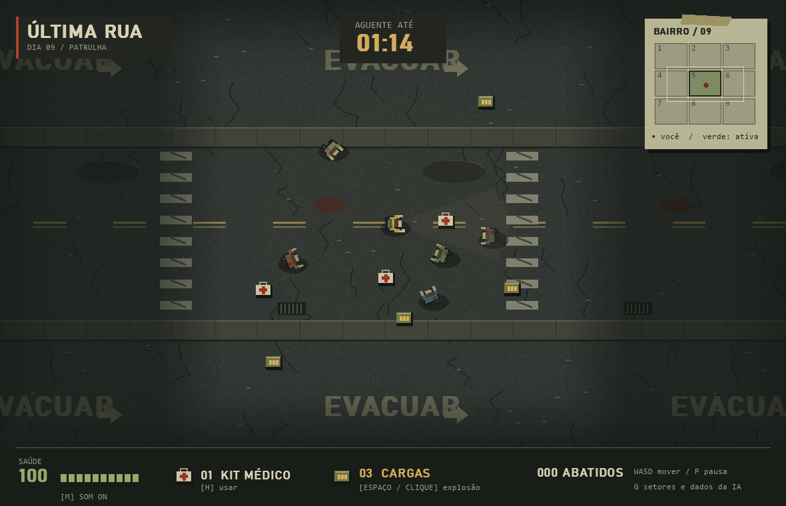

# ÚLTIMA RUA

Jogo de sobrevivência contra zumbis em Python/Pygame para a atividade de IA para jogos. Bairro evacuado em pixel art procedural, cinco variações de zumbis animados, sobrevivente com lanterna, mapa de papel e efeitos sonoros sintetizados.



[Ver o menu do jogo](previa-zumbis-menu.png)

## Executar no Windows

Dê dois cliques em **iniciar.bat**. Na primeira execução, ele cria um ambiente virtual e instala a dependência (precisa de internet).

Ou, pelo PowerShell, dentro da pasta:

```powershell
python -m venv .venv
.\.venv\Scripts\python.exe -m pip install -r requirements.txt
.\.venv\Scripts\python.exe main.py
```

Requer Python 3.10 ou superior. Usa **pygame-ce**, uma distribuição compatível com `import pygame`. Não instale `pygame` e `pygame-ce` juntos no mesmo ambiente. Não precisa de imagens, fontes ou sons externos.

## Controles

| Comando | Ação |
| --- | --- |
| WASD ou setas | Mover jogador |
| H | Consumir kit e recuperar até 40 de saúde |
| Espaço ou clique na arena | Detonar uma carga e causar dano aos zumbis próximos |
| P ou Esc | Pausar/continuar |
| G | Mostrar/ocultar malha, zona de ativação e dados da IA |
| M | Ligar/desligar efeitos sonoros |
| Setas no menu | Selecionar cenário |
| Enter | Iniciar, continuar ou reiniciar conforme a tela |
| R na tela final | Reiniciar o cenário |

Os itens são coletados por contato e guardados no inventário. Um kit não é consumido com a saúde cheia. A explosão tem intervalo de 0,45 segundo entre usos e usa a regra original de `pulse()` em `core.py`: dano instantâneo em um raio ao redor do jogador, sem dano a si mesmo. A perda de foco pausa a partida.

A lanterna e a névoa são efeitos visuais: não alteram a percepção dos NPCs. Ruas, calçadas baixas e marcas no chão não bloqueiam movimento. A arte é desenhada em código e as rotações dos sprites ficam em cache. Até 160 marcas decorativas de abates permanecem durante a partida. A ausência de dispositivo de áudio não impede jogar.

## Requisitos implementados

- Mundo com **9 áreas em uma malha 3 × 3**, contendo inimigos, kits de saúde e munição.
- **Viewport independente da malha**: câmera contínua seguindo o jogador, limitada às bordas do mundo. O retângulo claro no minimapa representa a câmera; verde indica áreas ativas e o ponto vermelho é o jogador.
- A área atual fica ativa; uma vizinha é ativada quando o jogador chega à distância configurada da borda. Próximo a um canto, também é ativada a diagonal. São **1, 2 ou 4 áreas ativas**.
- A distância de ativação deve ser **menor que metade do lado da área**, impedindo vizinhas de lados opostos de ficarem ativas ao mesmo tempo.
- Apenas NPCs de áreas ativas são atualizados. Eles perseguem o jogador, podem atravessar áreas e causam dano por segundo durante a sobreposição. Contatos simultâneos somam dano.
- Dano do pulso considera a distância entre os centros. Seu raio deve ser menor ou igual à distância de ativação, para alcançar somente áreas que já estejam ativas.
- NPCs com saúde não positiva são removidos; jogador com saúde não positiva perde. Sobreviver ao tempo configurado vence. Morte tem prioridade se ocorrer no mesmo passo do fim do tempo.
- Estado inicial gerado aleatoriamente com **semente reproduzível**, a partir de configurações JSON.
- **Bônus de memória**: áreas são geradas sob demanda. Ao desativar, seu estado é serializado em JSON comprimido em uma pasta temporária e seus objetos são removidos da simulação. Ao retornar, posições, saúde, mortes e itens coletados são restaurados. A pasta temporária é removida ao reiniciar ou encerrar normalmente; não é um save permanente.

## Cenários e balanceamento

Edite `config.json` para alterar duração, semente, dano, velocidades, cura, munição, raio do pulso, distância de ativação e quantidade de itens. Reinicie o programa para aplicar.

| Cenário | Inimigos totais | Lado de cada área |
| --- | ---: | ---: |
| Patrulha | 45 | 520 |
| Cerco | 450 | 760 |
| Enxame | 3000 | 1040 |

O tempo padrão é 75 segundos. O jogador começa com um kit e três munições. A dificuldade cresce com a densidade de NPCs; os cenários de maior carga também servem como testes de estresse. Não há colisão entre NPCs: o foco da atividade é ativação espacial, perseguição e sobrevivência.

```powershell
.\.venv\Scripts\python.exe main.py --preset 3
.\.venv\Scripts\python.exe benchmark.py
```

O benchmark compara ficar parado com seguir uma rota pelo mapa e usar itens disponíveis. Mede tempo médio de simulação, incluindo trocas de áreas, mas **não mede FPS da interface**. É uma comparação reproduzível de estratégias simples, não uma estimativa da dificuldade para todos os jogadores. A tecla G mostra FPS, NPCs atualizados por passo e NPCs visíveis.

## Validação

```powershell
.\.venv\Scripts\python.exe -m unittest discover -s tests -v
.\.venv\Scripts\python.exe main.py --smoke-test
.\.venv\Scripts\python.exe main.py --screenshot previa-zumbis.png --preview-seconds 1.8
.\.venv\Scripts\python.exe main.py --screenshot previa-zumbis-menu.png --screen menu
```

Testes cobrem ativação, limite de quatro áreas, congelamento e restauração, migração de NPCs, dano por tempo, inventário, pulso, morte, vitória, movimento e câmera. A simulação usa passo fixo de 1/60 s e descarta atrasos excessivos para evitar saltos após travamentos.

## Arquivos

- `core.py`: regras do jogo, geração e persistência das áreas; sem dependência gráfica.
- `main.py`: janela, entrada, câmera, desenho, menu e HUD.
- `visuals.py`: texturas, sprites, animações, névoa e iluminação.
- `sound.py`: efeitos sonoros opcionais, sem arquivos externos.
- `config.json`: parâmetros e cenários.
- `benchmark.py`: cenários automatizados de balanceamento e custo da simulação.
- `tests/test_core.py`: testes das regras.
- `iniciar.bat`: instalação inicial e execução no Windows.

A atualização custa O(N ativo + itens ativos), sem comparações entre todos os pares de inimigos. A renderização percorre NPCs ativos e desenha somente os que estão na câmera. As gravações de áreas são síncronas; cruzamentos com populações muito grandes podem provocar picos no tempo de quadro.
